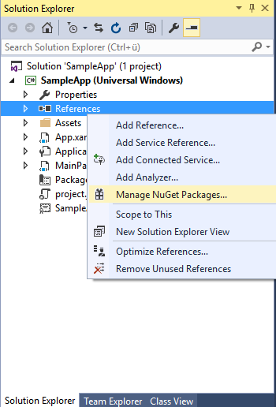
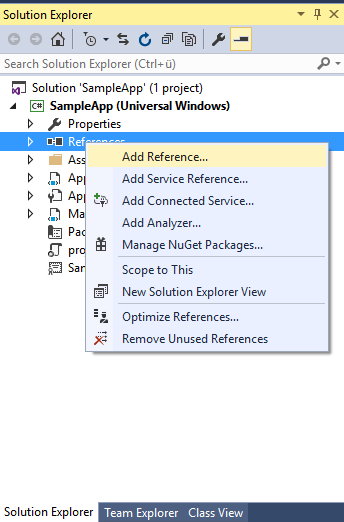
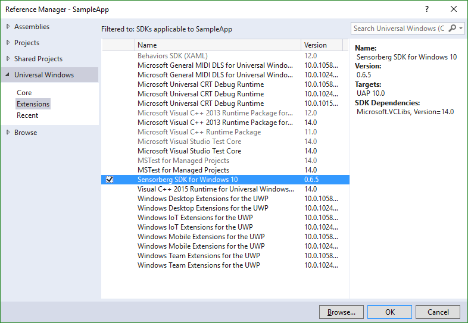
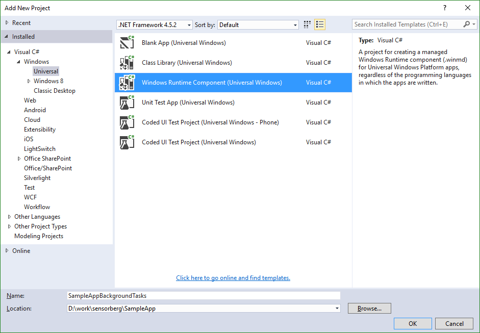
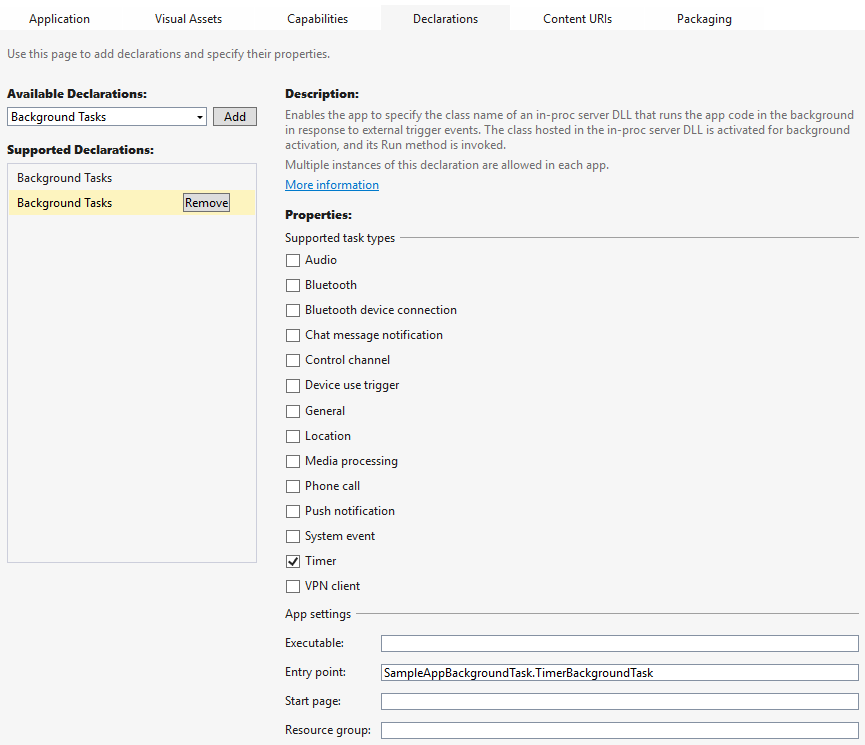
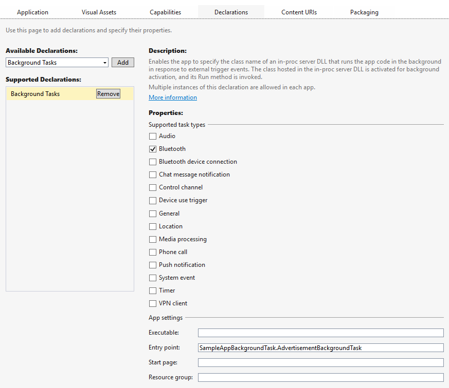
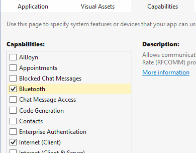

# Sensorberg SDK for Window #

## Compatibility ##

Sensorberg SDK for Windows is supported on Windows 10, this include Desktop, Mobile and IoT. It should also run on any other Windows 10 plattform that supports bluetooth.


## Taking Sensorberg SDK into use ##

### 1. Add Sensorberg SDK projects into your solution ###

#### 1.1 Nuget ####

You can download the latest nuget package from https://github.com/sensorberg-dev/windows10-sdk/releases or the nuget repository.

Add the SDK to your application project:



#### 1.2 VSIX ####

You can download the latest VSIX package from https://github.com/sensorberg-dev/windows10-sdk/releases and install it.

Add the SDK to your application project as references. Right click
**References** under your application project and select **Add Reference...**



Locate the SDK project and make sure that the check boxes in front of them
are checked and click **OK**.
 



### 3. Create BackgroundTasks (optional) ###

If your app need to be running in as a BackgroundTask, you have to create a special project for the backgroundTasks.

#### 3.1 Create Project ####

Create a new project **Windows Runtime Component (Universal Windows)**.
For the full support of the SDK are two BackgroundTasks needed.



##### 3.2 TimedBackgroundTask #####

This BackgroundTask is triggered by a Timer, so the SDK can handles delayed notifications. Due the limitation of the system it is only fired every 15min.
Create a new class for this:
```C#
    public sealed class <TimerClassName> : IBackgroundTask
    {
        private TimedBackgroundWorker worker;

        public <TimerClassName>()
        {
            worker = new TimedBackgroundWorker();
            worker.BeaconActionResolved += (sender, action) => { Debug.Write("Action resolved: " + action.PayloadString); };
        }

        public void Run(IBackgroundTaskInstance taskInstance)
        {
            worker.Run(taskInstance);
        }
    }
```
The BeaconActionResolved is fired for every Event and will notify your app about the new Action.


##### 3.3 AdvertisementWatcherBackgroundTask #####

To receive the Beacons, the AdvertisementWatcherBackgroundTask needs to be created.
Create a new class for this:
```C#
    public sealed class <AdvertisementClassName>:IBackgroundTask
    {
        private AdvertisementWatcherBackgroundWorker worker;

        public <AdvertisementClassName>()
        {
            worker = new AdvertisementWatcherBackgroundWorker();
            worker.BeaconActionResolved += (sender, action) => { Debug.Write("Action resolved: " + action.PayloadString); };
        }

        public void Run(IBackgroundTaskInstance taskInstance)
        {
            worker.Run(taskInstance);
        }
    }
```
The BeaconActionResolved is fired for every Event and will notify your app about the new Action.

#### 3.4 Configure app for BackgroundTasks ####

Edit the `Package.appxmanifest` file, create two new `Background Task` declarations.
* Triggered by Timer and enter as entry point your  TimedBackgroundTask `<Namespace>.<TimerClassName>`


* Triggered by Bluetooth and enter as entry point your AdvertisementWatcherBackgroundTask '<Namespace>.<AdvertisementClassName>`


### 4. Declare capabilities in manifest file ###

Make sure that you have at least `internetClient` and `bluetooth` capabilities
declared in your `Package.appxmanifest` file:

```xml
  ...
  
  </Applications>

  <Capabilities>
    <Capability Name="internetClient" />
    <DeviceCapability Name="bluetooth" />
  </Capabilities>
</Package>
```



### 5. Take SDKManager into use ###

The following snippet demonstrates how to integrate the Sensorberg SDK
functionality to the main page of your application:

```C#
using SensorbergSDK;
using System;
using Windows.UI.Popups;
using Windows.UI.Xaml;
using Windows.UI.Xaml.Controls;
using Windows.UI.Xaml.Navigation;

namespace MySensorbergApp
{
    public sealed partial class MainPage : Page
    {
        private SDKManager _sdkManager;
        private const string ApiKey = "04a709a208c83e2bc0ec66871c46d35af49efde5151032b3e865768bbf878db8";
        private const ushort ManufacturerId = 0x004c;
        private const ushort BeaconCode = 0x0215;
        
        public MainPage()
        {
            this.InitializeComponent();

            _sdkManager = SDKManager.Instance();
            
            _sdkManager.BeaconActionResolved += OnBeaconActionResolvedAsync;
            Window.Current.VisibilityChanged += SDKManager.Instance.OnApplicationVisibilityChanged;
            _sdkManager.InitializeAsync(new SdkConfiguration()
                {
                    ApiKey = ApiKey,
                    ManufacturerId = ManufacturerId,
                    BeaconCode = BeaconCode,
                    BackgroundTimerClassName = "SimpleAppBackgroundTask.SimpleAppTimerBackgroundTask",
                    BackgroundAdvertisementClassName = "SimpleAppBackgroundTask.AdvertisementBackgroundTask"
                });
            await _sdkManager.RegisterBackgroundTaskAsync();
        }

        protected override async void OnNavigatedTo(NavigationEventArgs e)
        {
            base.OnNavigatedTo(e);

        }
        
        private async void OnBeaconActionResolvedAsync(object sender, BeaconAction e)
        {
            await Windows.ApplicationModel.Core.CoreApplication.MainView.CoreWindow.Dispatcher.RunAsync(
                Windows.UI.Core.CoreDispatcherPriority.Normal, async () =>
                {
                    MessageDialog messageDialog = e.ToMessageDialog();
                    await messageDialog.ShowAsync();
                });
        }
    }
}        
```

Sensorberg SDK is initialized with `InitializeAsync` method, which takes the configuration of the SDK.
For creating your service and API key, visit https://manage.sensorberg.com

You must implement the handling of the beacon actions in
`OnBeaconActionResolvedAsync()`. In the example above, we simply display a
message dialog with the action content.

It is also highly recommended to ask the user for the permission to enable the
background task. You can register and unregister the background task using `SDKManager` methods
`RegisterBackgroundTaskAsync` and `UnregisterBackgroundTask`.#
<br/>
<br/>
<br/>
<br/>
<br/>
